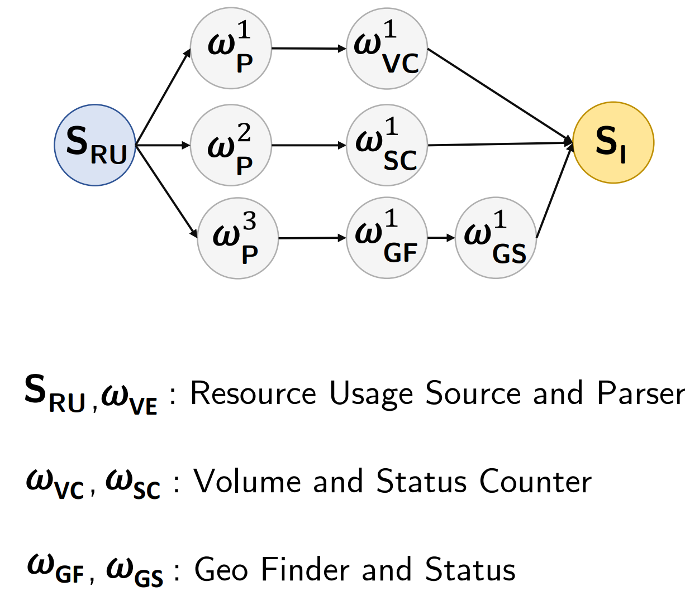
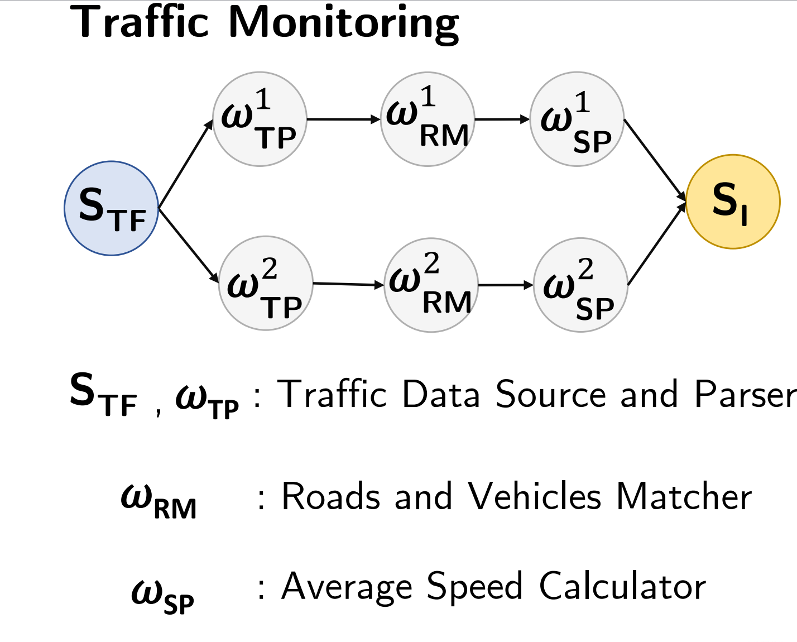

# PDSP-Bench Workloads (Real-World)

PDSP-Bench includes **14 real-world streaming workloads** inspired by established DSPS/database benchmarks and prior studies (e.g., **Linear Road**, **Smart Grid**, **Ads Analytics**, **Click Analytics**). The suite is designed to cover major performance indicators such as **CPU**, **network**, and **memory/state** behavior that react differently to changes in **Degree of Parallelism (DoP)**.

This diversity is important for evaluating **scaling efficiency**, because changing DoP can shift bottlenecks between CPU saturation, network bandwidth, and state/data redistribution overheads.

Based on operator semantics and communication patterns, we assign each workload a primary bottleneck class:

1. **CPU-bound pipelines** (compute saturation and thread contention)  
2. **Memory-bound / stateful workloads** (state access, memory pressure, coordination)  
3. **Network-bound / shuffle- / join-intensive pipelines** (repartitioning fan-out and exchange overhead)  
4. **Lightweight stateless / group-by pipelines** (coordination overhead and saturation)  
5. **Mixed operator / UDF-rich DAGs** (compound bottlenecks and bottleneck shifts)

---

## Workload Taxonomy

## 1) Lightweight Stateless / Group-by Pipelines

### Word Count (WC)

**Area:** Text Processing  
Processes a text stream, tokenizes sentences into words, and counts occurrences of each word in real-time using a keyed aggregation.  
**Why this class:** lightweight per-tuple processing with group-by aggregation; performance is sensitive to coordination and key distribution.

---

## 2) CPU-Bound Pipelines

### Machine Outlier (MO)

**Area:** Network Monitoring  
Detects anomalies in machine usage data by processing a usage stream using a median-based selection approach (e.g., BFPRT-style logic).  
**Why this class:** dominated by computation per tuple/window; scaling is driven by CPU saturation and UDF cost.

---

## 3) Memory-Bound / Stateful Workloads

### Spike Detection (SD)

**Area:** Sensor Network  
Processes sensor data streams to detect sudden temperature spikes by computing sliding-window averages and identifying deviations beyond a threshold.  
**Why this class:** windowed aggregation maintains state; state access, memory pressure, and coordination dominate at scale.

### Trending Topics (TT)

**Area:** Social Network  
Processes tweet streams to identify trending topics using parsing and aggregated popularity counts over windows with ranking/thresholding.  
**Why this class:** windowed counts and ranking maintain state; memory/state pressure grows with cardinality and window size.

### Smart Grid (SG)

**Area:** Sensor Network  
Analyzes smart-home energy usage through two queries that compute global and local loads using sliding windows.  
**Why this class:** stateful/windowed aggregations accumulate state; memory pressure and coordination costs are primary factors.

---

## 4) Network-Bound / Shuffle- / Join-Intensive Pipelines

### Ad Analytics (AD)

**Area:** Advertising  
Processes click and impression streams in separate pipelines and computes windowed click-through rate (CTR).  
**Why this class:** shuffle/exchange overhead is dominant due to repartitioning and combining streams at scale.

### Bargain Index (BI)

**Area:** Finance  
Analyzes stock quote streams to identify bargains by computing VWAP-like measures and a bargain index, emitting quotes that exceed a threshold.  
**Why this class:** high exchange volume with windowed computations; repartitioning and network overhead dominate under scale.

### TPC-H (TPCH)

**Area:** E-commerce  
Processes order events to emit high-priority orders and aggregates order priority occurrences within time windows.  
**Why this class:** grouping/aggregation at scale can stress repartitioning and network exchange paths.

---

## 5) Mixed Operator / UDF-Rich DAGs

### Linear Road (LR)

**Area:** Traffic Management  
Processes vehicle location streams through four queries (toll notification, accident notification, daily expenditure, total travel time) to calculate charges and detect incidents.  
**Why this class:** multi-stage pipeline with state and repartitioning; bottlenecks can shift between CPU, state coordination, and network.

### Logs Processing (LP)

**Area:** Web Analytics  
Processes HTTP server logs using two main queries: one counts visits per interval (volume counter), and another tallies status codes.  
**Why this class:** parsing + aggregation mix; bottleneck can shift between CPU parsing and coordination/state overhead.

### Google Cloud Monitoring (GCM)

**Area:** Cloud Infrastructure  
Computes average CPU usage over time, grouped by job or category, using sliding windows and grouping operators.  
**Why this class:** grouping + windowing + parsing leads to mixed behavior; bottleneck depends on cardinality and state pressure.

### Sentiment Analysis (SA)

**Area:** Social Network  
Determines tweet sentiment using parsing and classification operators (e.g., Basic/LingPipe classifiers) to score and label tweets.  
**Why this class:** UDF-heavy classification plus pipeline logic; bottlenecks can shift with DoP and input rate.

### Click Analytics (CA)

**Area:** Web Analytics  
Analyzes user clicks via two queries: (1) groups clicks by client to compute repeat/total visits per URL, (2) identifies geographic origins using a Geo-IP database.  
**Why this class:** enrichment + aggregation + state; compound bottlenecks and bottleneck shifts are common.

### Traffic Monitoring (TM)

**Area:** Sensor Network  
Matches vehicle locations to road segments (map matching) and computes average speed per segment via aggregation.  
**Why this class:** compute-heavy matching plus stateful aggregation; bottleneck can shift between CPU and state/coordination.

---

## Summary Table

<table>
  <thead>
    <tr>
      <th>Workload</th>
      <th>CPU</th>
      <th>State</th>
      <th>Network</th>
      <th>UDF</th>
      <th>Stateless</th>
      <th>ML</th>
      <th>Why this category?</th>
      <th>Data flow graph (query plan)</th>
    </tr>
  </thead>
  <tbody>
    <tr>
      <td><b>AD</b> (Ads Analytics)</td>
      <td></td><td>✓</td><td>✓</td><td></td><td></td><td></td>
      <td>Two-branch pipeline that aggregates clicks and impressions, then performs a windowed join; join state and repartitioning dominate.</td>
      <td><code>Source</code> &rarr; <code>ParseClicks</code> || <code>ParseImpressions</code> &rarr; <code>keyBy(qid,adid)</code> &rarr; <code>Agg(sum)</code> || <code>Agg(sum)</code> &rarr; <code>WindowJoin</code> &rarr; <code>Filter/CTR</code> &rarr; <code>Sink</code></td>
    </tr>
     <tr>
      <td><b>BI</b> (Bargain Index)</td>
      <td></td><td>✓</td><td></td><td>✓</td><td></td><td></td>
      <td>Keyed sliding window maintains VWAP state/timers; downstream index computation is secondary.</td>
      <td><code>Source</code> &rarr; <code>ParseQuote(map)</code> &rarr; <code>keyBy(sym)</code> &rarr; <code>WinAgg(VWAP)</code> &rarr; <code>ComputeBI(flatMap)</code> &rarr; <code>Sink</code></td>
    </tr>
    <tr>
      <td><b>CA</b> (Click Analytics)</td>
      <td></td><td>✓</td><td></td><td>✓ (Q2)</td><td></td><td></td>
      <td>Repeat-visit keeps keyed window state and adds a second keyed reduce; geo variant adds enrichment UDFs.</td>
      <td>
        <code>Source</code> &rarr; <code>ParseClick(map)</code> &rarr;
         
        <small>
          (Q1/Q3: <code>keyBy(client)</code> &rarr; <code>WinAgg(RV)</code> &rarr; <code>keyBy(url)</code> &rarr; <code>Reduce</code>)
          &nbsp;||&nbsp;
          (Q2: <code>GeoEnrich(Process/UDF)</code>)
        </small>
         
        &rarr; <code>Sink</code>
      </td>
    </tr>
    <tr>
      <td><b>GCM</b> (Google Cloud Monitoring)</td>
      <td></td><td>✓</td><td></td><td>✓</td><td></td><td></td>
      <td>Keyed sliding windows per category/job maintain state and trigger timers; window coordination dominates.</td>
      <td><code>Source</code> &rarr; <code>ParseTaskEvt(map)</code> &rarr; <code>keyBy(cat/job)</code> &rarr; <code>WinAgg(Apply/Process)</code> &rarr; <code>Sink</code></td>
    </tr>
    <tr>
      <td><b>LR</b> (Linear Road)</td>
      <td></td><td>✓</td><td></td><td></td><td></td><td></td>
      <td>All variants are key-driven and/or windowed, requiring per-key tracking and window coordination.</td>
      <td>
        <code>Source</code> &rarr; <code>ParseVehicle(map)</code> &rarr;
        <small>
          (Q1: <code>keyBy(veh)</code> &rarr; <code>map</code>) |
          (Q2: <code>keyBy(time)</code> &rarr; <code>WindowProcess</code>) |
          (Q3/Q4: <code>keyBy(veh)</code> &rarr; <code>map</code>)
        </small>
        &rarr; <code>Sink</code>
      </td>
    </tr>
    <tr>
      <td><b>LA</b> (Log Processing)</td>
      <td></td><td>✓</td><td></td><td>✓</td><td></td><td></td>
      <td>Keyed sliding-window counters maintain per-window state and timers for volume/status metrics.</td>
      <td><code>Source</code> &rarr; <code>ParseLog(map)</code> &rarr; <code>keyBy(logTime)</code> &rarr; <code>WinAgg(Volume/Status)</code> &rarr; <code>Sink</code></td>
    </tr>
    <tr>
      <td><b>MO</b> (Machine Outlier)</td>
      <td>✓</td><td>✓</td><td></td><td>✓</td><td></td><td></td>
      <td>Keyed sliding window maintains state while the window function runs compute-heavy outlier selection.</td>
      <td><code>Source</code> &rarr; <code>ParseMachineUsage(map)</code> &rarr; <code>keyBy(machine)</code> &rarr; <code>WinAgg(Outlier/BFPRT)</code> &rarr; <code>Sink</code></td>
    </tr>
    <tr>
      <td><b>SA</b> (Sentiment Analysis)</td>
      <td>✓</td><td></td><td></td><td>✓</td><td></td><td>✓</td>
      <td>Text preprocessing and sentiment classification are compute-heavy and ML-based; CPU/UDF dominate.</td>
      <td><code>ParseJSON</code> &rarr; <code>Filter(lang)</code> &rarr; <code>Preproc</code> &rarr; <code>Classify(ML)</code> &rarr; <code>Sink</code></td>
    </tr>
    <tr>
      <td><b>SG</b> (Smart Grid)</td>
      <td></td><td>✓</td><td></td><td>✓</td><td></td><td></td>
      <td>Keyed sliding windows maintain per-house state and timers; repartitioning increases coordination at higher DoP.</td>
      <td><code>Source</code> &rarr; <code>ParseHouseEvt(map)</code> &rarr; <code>keyBy(house / house,hh,plug)</code> &rarr; <code>WinAgg(Q1/Q2)</code> &rarr; <code>Sink</code></td>
    </tr>
    <tr>
      <td><b>SD</b> (Spike Detection)</td>
      <td></td><td>✓</td><td></td><td>✓</td><td></td><td></td>
      <td>Keyed moving-average window maintains state; downstream spike filter is lightweight.</td>
      <td><code>Source</code> &rarr; <code>ParseSensor(flatMap)</code> &rarr; <code>keyBy(sensor)</code> &rarr; <code>WinAgg(MovAvg)</code> &rarr; <code>Filter(spike)</code> &rarr; <code>Sink</code></td>
    </tr>
    <tr>
      <td><b>TPCH</b> (TPC-H Stream Query)</td>
      <td></td><td>✓ (Q2)</td><td></td><td>✓</td><td>✓ (Q1)</td><td></td>
      <td>Q1 is lightweight filter/mapping; Q2 adds a keyed sliding window; both end in keyed priority aggregation.</td>
      <td>
        <code>Source</code> &rarr; <code>ParseTPCH(map)</code> &rarr;
        <small>(Q1: <code>Filter</code>) | (Q2: <code>keyBy(discount)</code> &rarr; <code>WinAgg</code>)</small>
        &rarr; <code>MapPriority(flatMap)</code> &rarr; <code>keyBy(priority)</code> &rarr; <code>Agg(sum)</code> &rarr; <code>Sink</code>
      </td>
    </tr>
    <tr>
      <td><b>TM</b> (Traffic Monitoring)</td>
      <td>✓</td><td>✓</td><td></td><td>✓</td><td></td><td></td>
      <td>Map matching is a compute-heavy UDF, followed by a keyed sliding-window aggregation per road.</td>
      <td><code>Source</code> &rarr; <code>ParseTraffic(map)</code> &rarr; <code>MapMatch(UDF)</code> &rarr; <code>keyBy(road)</code> &rarr; <code>WinAgg(AvgSpeed)</code> &rarr; <code>Sink</code></td>
    </tr>
    <tr>
      <td><b>TT</b> (Trending Topics)</td>
      <td>✓</td><td>✓</td><td></td><td>✓</td><td></td><td></td>
      <td>Topic extraction is compute-heavy; then keyed sliding-window counting maintains state/timers before thresholding.</td>
      <td><code>Source</code> &rarr; <code>ParseTweet(map)</code> &rarr; <code>ExtractTopic(UDF)</code> &rarr; <code>keyBy(topic)</code> &rarr; <code>WinAgg(Count)</code> &rarr; <code>Filter(thresh)</code> &rarr; <code>Sink</code></td>
    </tr>
    <tr>
      <td><b>WC</b> (WordCount)</td>
      <td></td><td></td><td></td><td></td><td>✓</td><td></td>
      <td>Simple split-and-count; keyed aggregation; lightweight per-record work and minimal state.</td>
      <td><code>Source</code> &rarr; <code>Split(flatMap)</code> &rarr; <code>keyBy(word)</code> &rarr; <code>Agg(sum)</code> &rarr; <code>Sink</code></td>
    </tr>
  </tbody>
</table>

## Notes on Interpretation

- This classification reflects the **dominant** bottleneck under typical configurations. Under different rates, key cardinalities, and DoP settings, workloads may **shift** bottlenecks.
- The taxonomy is intended to guide scaling studies, heterogeneous resource selection, and comparisons across Flink vs Storm.