# PDSP-Bench Workloads (Real-World)

PDSP-Bench includes **14 real-world streaming workloads** inspired by established DSPS/database benchmarks and prior studies (e.g., **Linear Road**, **Smart Grid**, **Ads Analytics**, **Click Analytics**). The suite is designed to cover major performance indicators such as **CPU**, **network**, and **memory/state** behavior that react differently to changes in **Degree of Parallelism (DoP)**.

This diversity is important for evaluating **scaling efficiency**, because changing DoP can shift bottlenecks between CPU saturation, network bandwidth, and state/data redistribution overheads.

Based on operator semantics and communication patterns, we assign each workload a primary bottleneck class:

1. **CPU-bound pipelines** (compute saturation and thread contention)  
2. **Memory-bound / stateful workloads** (state access, memory pressure, coordination)  
3. **Network-bound / shuffle- / join-intensive pipelines** (repartitioning fan-out and exchange overhead)  
4. **Lightweight stateless / group-by pipelines** (coordination overhead and saturation)  
5. **Mixed operator / UDF-rich DAGs** (compound bottlenecks and bottleneck shifts)

---

## Workload Taxonomy

## 1) Lightweight Stateless / Group-by Pipelines

### Word Count (WC)
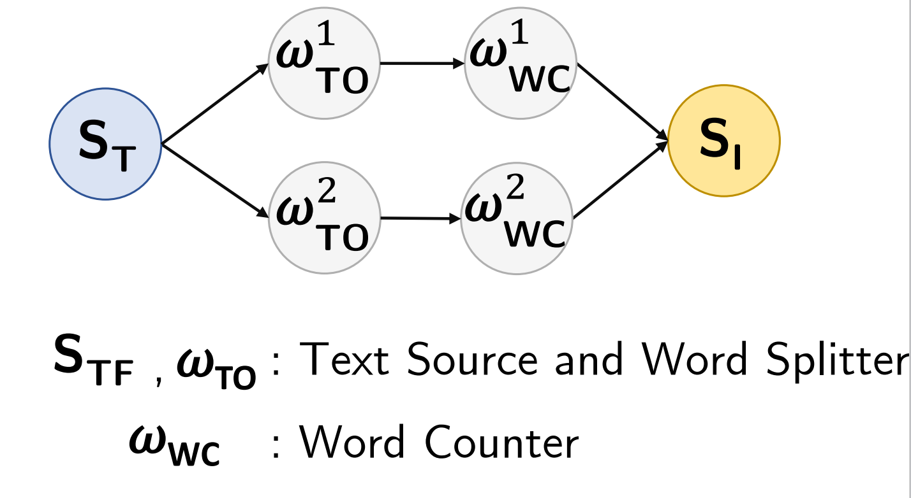

**Area:** Text Processing  
Processes a text stream, tokenizes sentences into words, and counts occurrences of each word in real-time using a keyed aggregation.  
**Why this class:** lightweight per-tuple processing with group-by aggregation; performance is sensitive to coordination and key distribution.

---

## 2) CPU-Bound Pipelines

### Machine Outlier (MO)
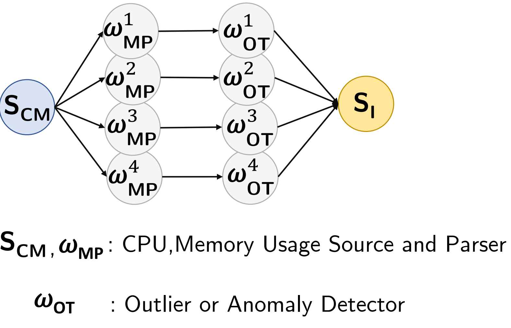

**Area:** Network Monitoring  
Detects anomalies in machine usage data by processing a usage stream using a median-based selection approach (e.g., BFPRT-style logic).  
**Why this class:** dominated by computation per tuple/window; scaling is driven by CPU saturation and UDF cost.

---

## 3) Memory-Bound / Stateful Workloads

### Spike Detection (SD)
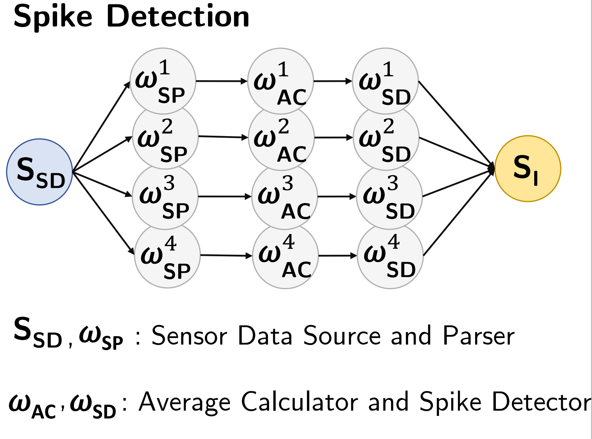

**Area:** Sensor Network  
Processes sensor data streams to detect sudden temperature spikes by computing sliding-window averages and identifying deviations beyond a threshold.  
**Why this class:** windowed aggregation maintains state; state access, memory pressure, and coordination dominate at scale.

### Trending Topics (TT)
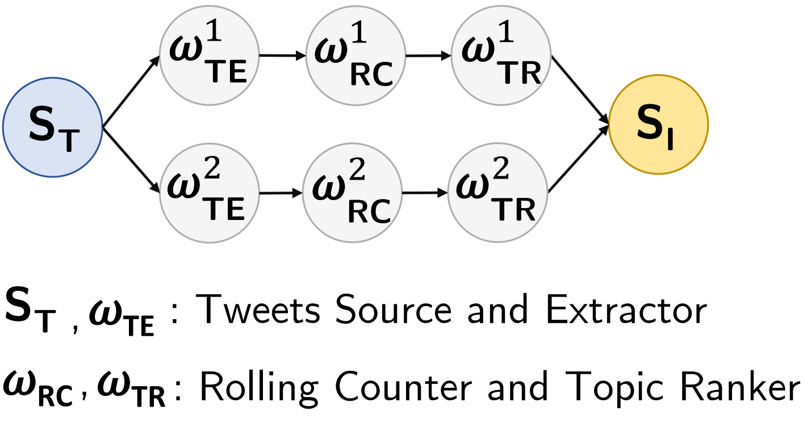

**Area:** Social Network  
Processes tweet streams to identify trending topics using parsing and aggregated popularity counts over windows with ranking/thresholding.  
**Why this class:** windowed counts and ranking maintain state; memory/state pressure grows with cardinality and window size.

### Smart Grid (SG)

**Area:** Sensor Network  
Analyzes smart-home energy usage through two queries that compute global and local loads using sliding windows.  
**Why this class:** stateful/windowed aggregations accumulate state; memory pressure and coordination costs are primary factors.

---

## 4) Network-Bound / Shuffle- / Join-Intensive Pipelines

### Ad Analytics (AD)
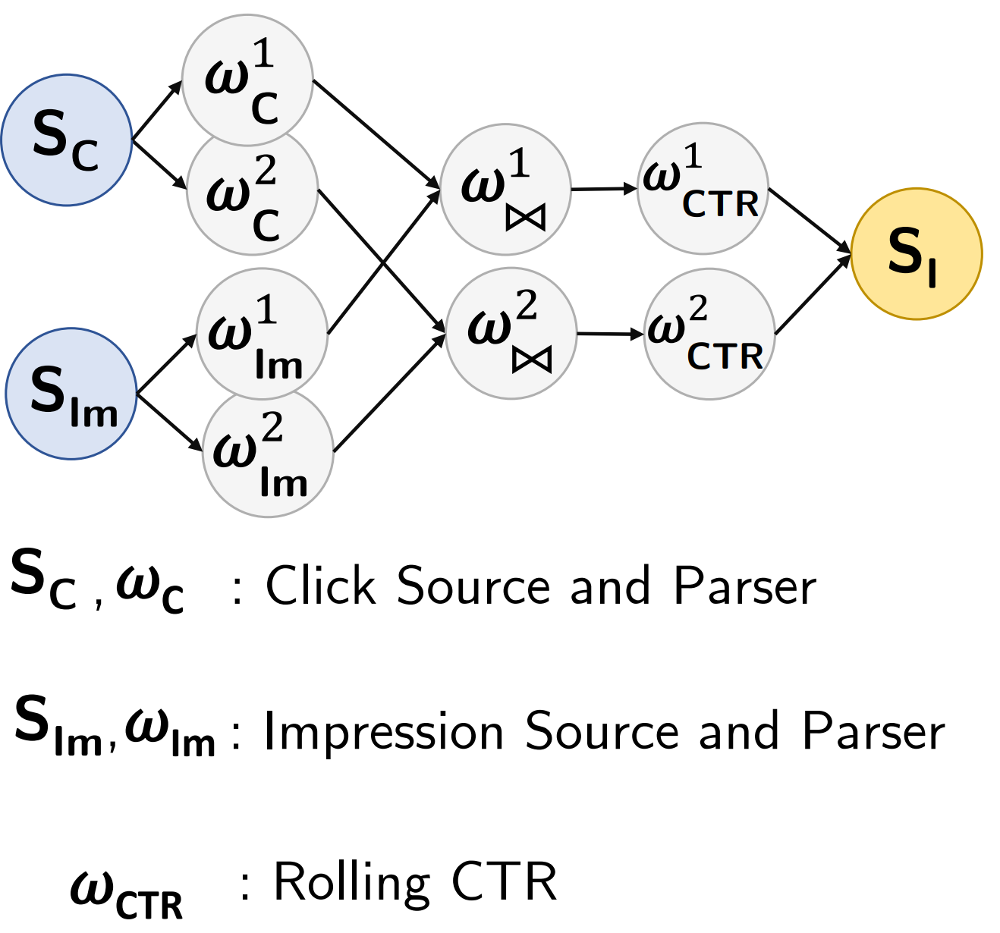

**Area:** Advertising  
Processes click and impression streams in separate pipelines and computes windowed click-through rate (CTR).  
**Why this class:** shuffle/exchange overhead is dominant due to repartitioning and combining streams at scale.

### Bargain Index (BI)
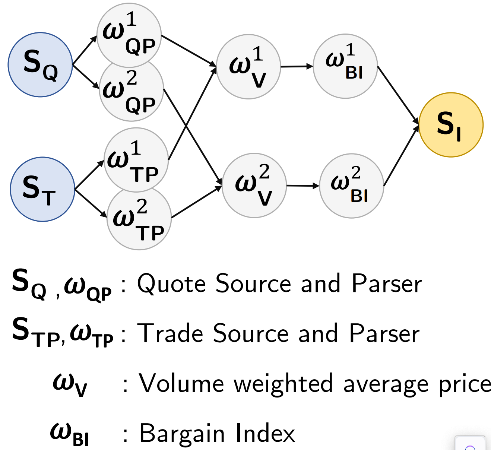

**Area:** Finance  
Analyzes stock quote streams to identify bargains by computing VWAP-like measures and a bargain index, emitting quotes that exceed a threshold.  
**Why this class:** high exchange volume with windowed computations; repartitioning and network overhead dominate under scale.

### TPC-H (TPCH)
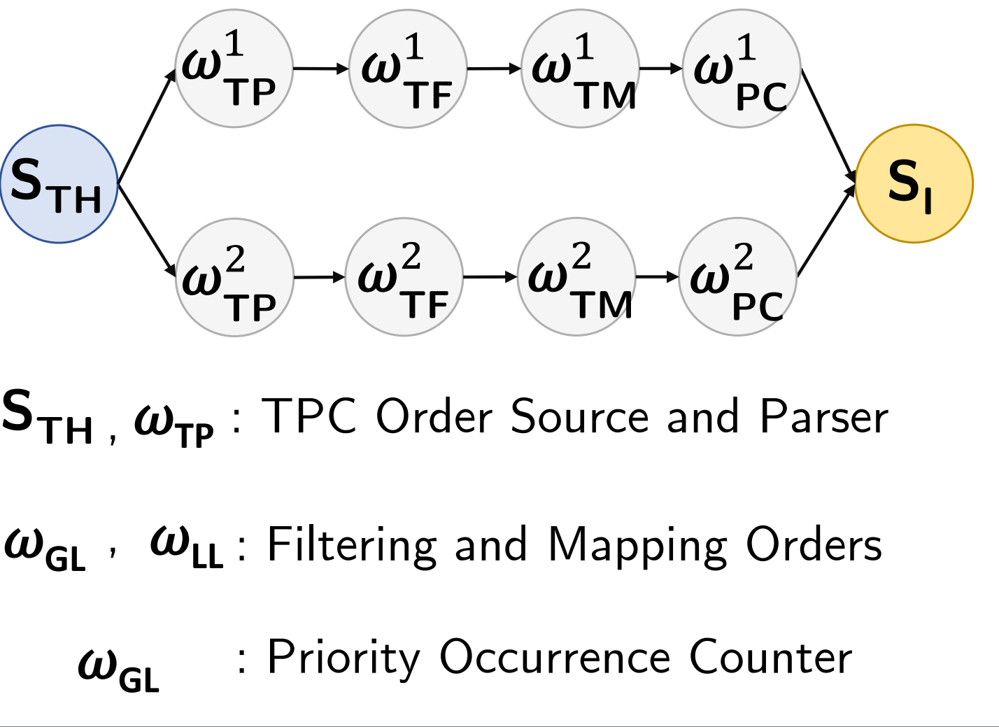

**Area:** E-commerce  
Processes order events to emit high-priority orders and aggregates order priority occurrences within time windows.  
**Why this class:** grouping/aggregation at scale can stress repartitioning and network exchange paths.

---

## 5) Mixed Operator / UDF-Rich DAGs

### Linear Road (LR)
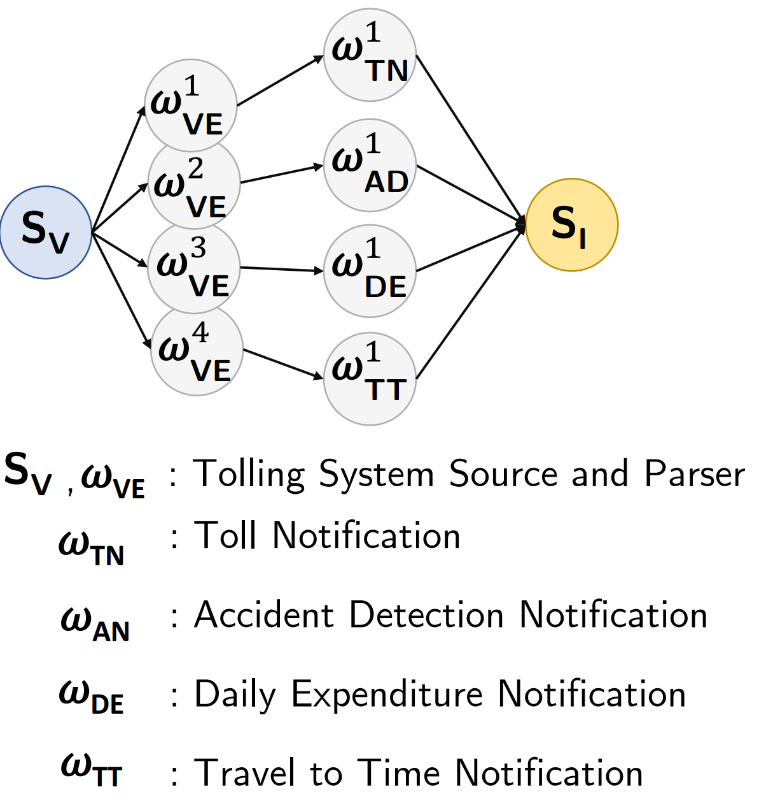

**Area:** Traffic Management  
Processes vehicle location streams through four queries (toll notification, accident notification, daily expenditure, total travel time) to calculate charges and detect incidents.  
**Why this class:** multi-stage pipeline with state and repartitioning; bottlenecks can shift between CPU, state coordination, and network.

### Logs Processing (LP)

**Area:** Web Analytics  
Processes HTTP server logs using two main queries: one counts visits per interval (volume counter), and another tallies status codes.  
**Why this class:** parsing + aggregation mix; bottleneck can shift between CPU parsing and coordination/state overhead.

### Google Cloud Monitoring (GCM)
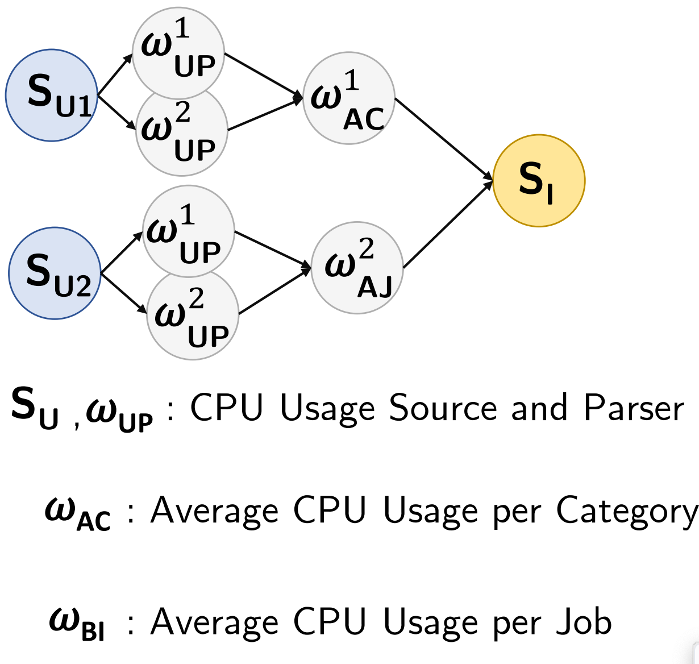

**Area:** Cloud Infrastructure  
Computes average CPU usage over time, grouped by job or category, using sliding windows and grouping operators.  
**Why this class:** grouping + windowing + parsing leads to mixed behavior; bottleneck depends on cardinality and state pressure.

### Sentiment Analysis (SA)
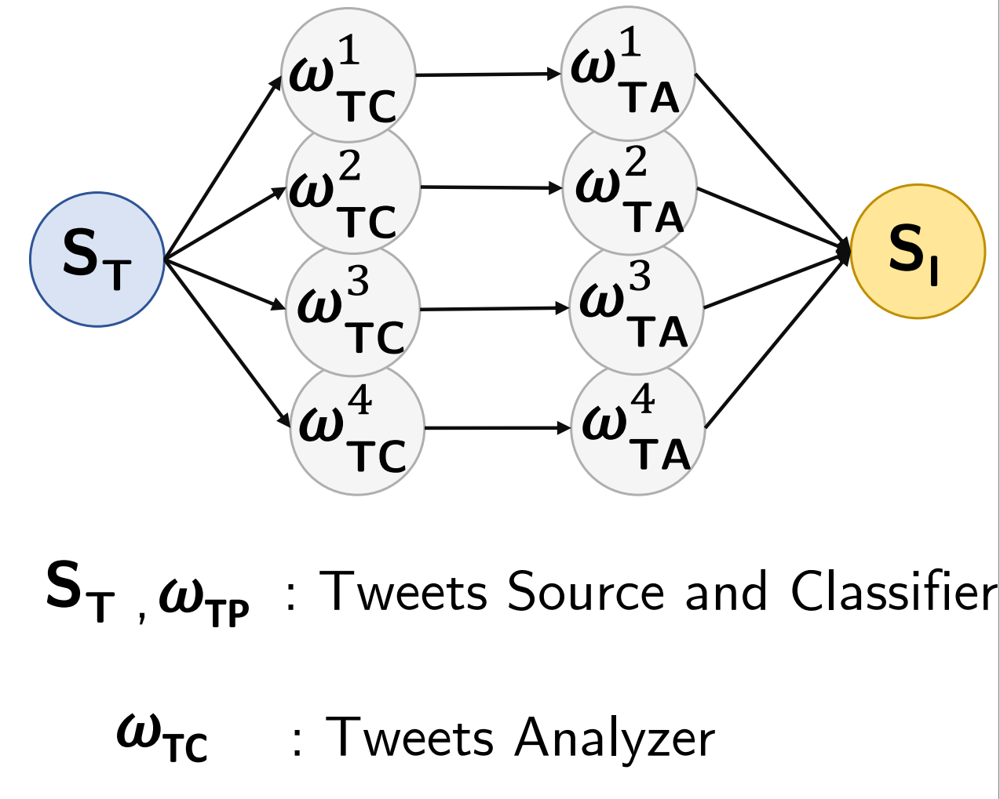

**Area:** Social Network  
Determines tweet sentiment using parsing and classification operators (e.g., Basic/LingPipe classifiers) to score and label tweets.  
**Why this class:** UDF-heavy classification plus pipeline logic; bottlenecks can shift with DoP and input rate.

### Click Analytics (CA)
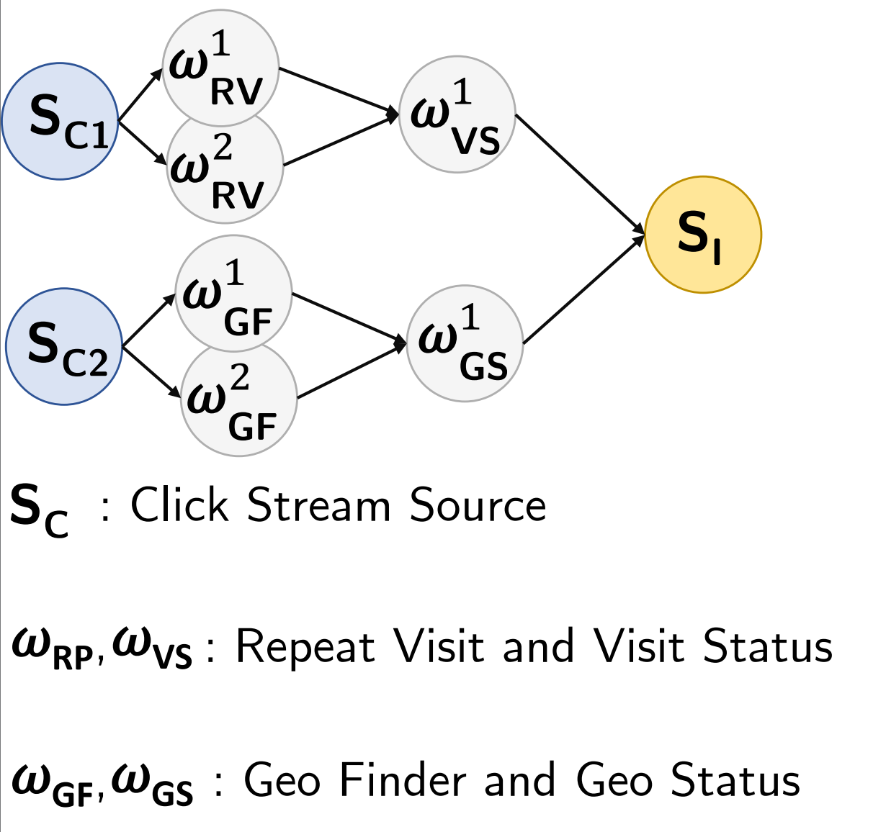

**Area:** Web Analytics  
Analyzes user clicks via two queries: (1) groups clicks by client to compute repeat/total visits per URL, (2) identifies geographic origins using a Geo-IP database.  
**Why this class:** enrichment + aggregation + state; compound bottlenecks and bottleneck shifts are common.

### Traffic Monitoring (TM)

**Area:** Sensor Network  
Matches vehicle locations to road segments (map matching) and computes average speed per segment via aggregation.  
**Why this class:** compute-heavy matching plus stateful aggregation; bottleneck can shift between CPU and state/coordination.

---

## Summary Table

| Workload | Area | Primary bottleneck class |
|---|---|---|
| WC | Text Processing | Lightweight stateless / group-by |
| MO | Network Monitoring | CPU-bound |
| LR | Traffic Management | Mixed operator / UDF-rich |
| LP | Web Analytics | Mixed operator / UDF-rich |
| GCM | Cloud Infrastructure | Mixed operator / UDF-rich |
| TPCH | E-commerce | Network-bound / shuffle-/join-intensive |
| BI | Finance | Network-bound / shuffle-/join-intensive |
| SA | Social Network | Mixed operator / UDF-rich |
| SG | Sensor Network | Memory-bound / stateful |
| CA | Web Analytics | Mixed operator / UDF-rich |
| SD | Sensor Network | Memory-bound / stateful |
| TT | Social Network | Memory-bound / stateful |
| TM | Sensor Network | Mixed operator / UDF-rich |
| AD | Advertising | Network-bound / shuffle-/join-intensive |

---

## Notes on Interpretation

- This classification reflects the **dominant** bottleneck under typical configurations. Under different rates, key cardinalities, and DoP settings, workloads may **shift** bottlenecks.
- The taxonomy is intended to guide scaling studies, heterogeneous resource selection, and comparisons across Flink vs Storm.